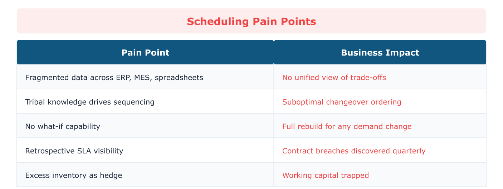
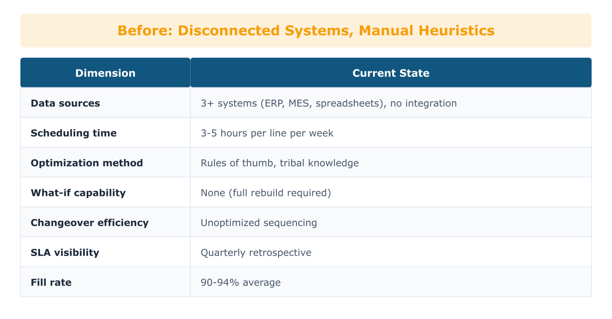
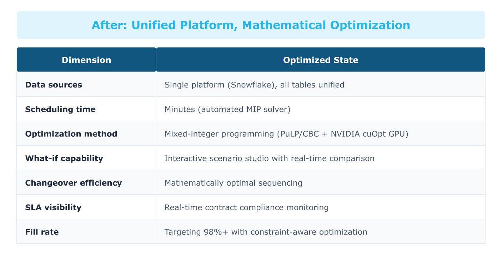
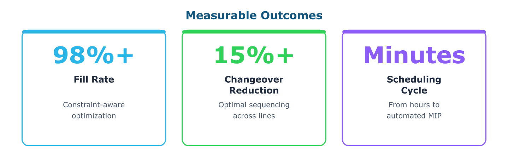
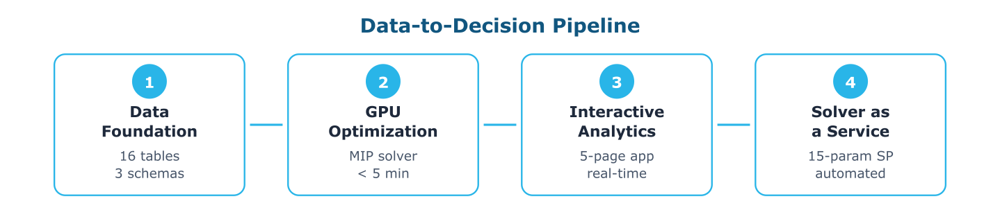
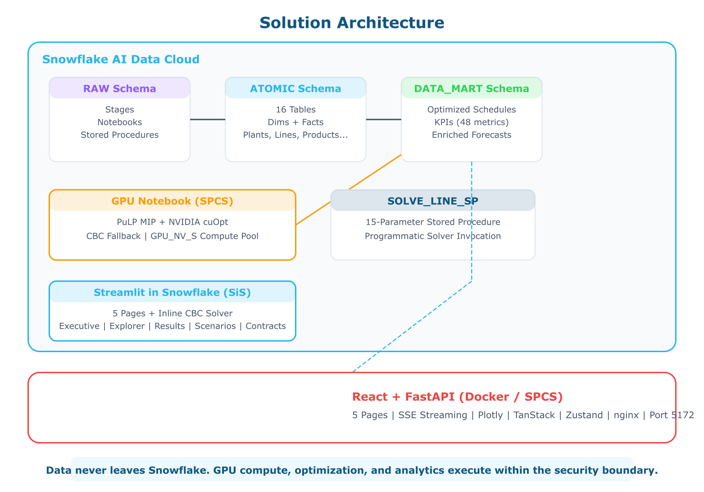
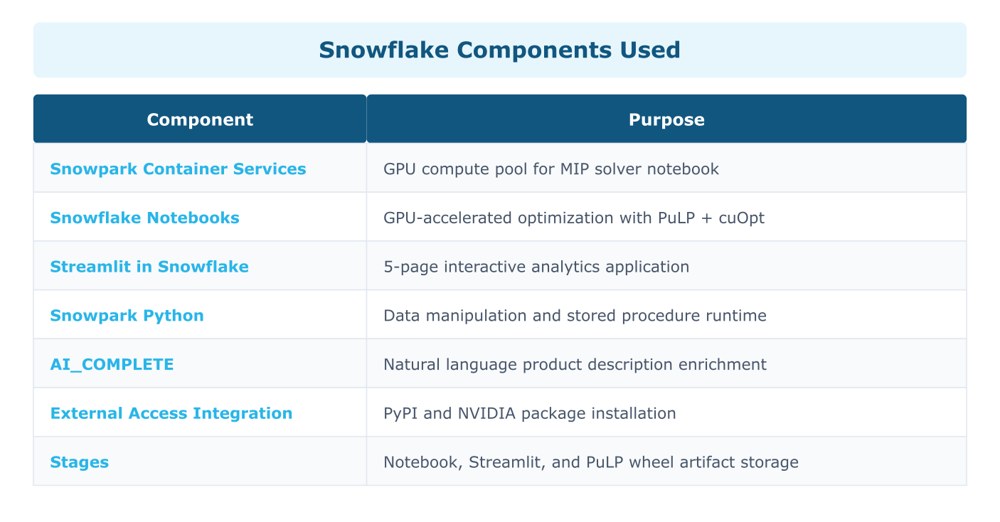

# Product Wheel Schedule Optimization

## Snowcore Contract Manufacturing: AI-Driven Production Scheduling on Snowflake

---

## 1. Cost of Inaction

In 2023, a major North American contract food manufacturer shut down two production lines for 72 hours after a scheduling error caused cross-contamination between allergen classes. The rework cost exceeded 2 million dollars. The root cause was not negligence. It was a spreadsheet.

Contract manufacturers manage hundreds of SKUs across shared production lines for multiple brand-owner customers. Every week, production schedulers manually construct "product wheels" that determine which products run, in what sequence, and for how long. The inputs live in at least three disconnected systems: demand forecasts in ERP, changeover rules in tribal spreadsheets, and line calendars in MES. The result is a scheduling process that takes hours to produce and minutes to invalidate.

The consequences compound. Changeover time typically accounts for 5 to 20 percent of planned production time across consumer goods manufacturing. OTIF fill rates in contract manufacturing average 90 to 94 percent against contractual targets of 95 to 98 percent. Each percentage point of missed fill rate erodes customer trust, triggers penalty clauses, and accelerates contract churn. Meanwhile, excess finished-goods inventory builds as a hedge against scheduling uncertainty, trapping working capital that should be deployed elsewhere.

McKinsey estimates that AI-driven production optimization can deliver 10 to 20 percent productivity improvement in manufacturing environments. For a contract manufacturer running 8 production lines at 50 million dollars in annual throughput, a 15 percent reduction in changeover hours alone represents over 1 million dollars in recovered capacity per year.

The cost of inaction is not the scheduling error that makes headlines. It is the invisible margin erosion that happens every shift, on every line, in every plant.

---

## 2. Problem in Context

Five structural pain points define the scheduling challenge in contract manufacturing.

**Fragmented data, fragmented decisions.** Demand forecasts, changeover matrices, line calendars, throughput rates, and inventory positions live in separate systems. No single view exists to evaluate trade-offs between fill rate, changeover time, and inventory cost. Schedulers rely on experience and approximation rather than optimization.

**Manual wheel construction takes hours and delivers heuristics.** Industry practitioners estimate that a typical production scheduler spends 3 to 5 hours per week building a product wheel for a single line. The process involves cross-referencing spreadsheets, applying tribal knowledge about allergen sequencing, and negotiating with customer service teams about priority. The output is a feasible schedule, not an optimal one.

**Contractual SLAs create competing constraints.** Each customer contract specifies a fill rate target (typically 95 to 98 percent), a maximum days-of-supply threshold, and minimum annual volumes by SKU. Optimizing for one customer often degrades service to another. Without mathematical optimization, these trade-offs are invisible until they appear as SLA breaches at quarter-end.

**Changeover sequencing is solved by habit, not mathematics.** The sequence in which products run on a shared line determines total changeover time. A product wheel with 10 SKUs has over 3 million possible sequences. Schedulers use rules of thumb that produce workable but suboptimal sequences. Orca Lean's analysis of American manufacturing operations documents that systematic changeover optimization can recover up to 40 percent of changeover time.

**What-if analysis is effectively impossible.** When demand shifts, a new customer contract arrives, or a line goes down for maintenance, the scheduler rebuilds the wheel from scratch. There is no mechanism to rapidly evaluate alternative scenarios, quantify the impact of parameter changes, or compare baseline and adjusted schedules side by side.

---

## 3. The Transformation

### Before: Disconnected Systems, Manual Heuristics

### After: Unified Platform, Mathematical Optimization

The transformation is not incremental. It replaces a manual, heuristic process with a mathematically rigorous optimization that runs in minutes, evaluates millions of possible sequences, and delivers an executable schedule with full visibility into trade-offs.

---

## 4. What We Will Achieve

Three measurable outcomes define success.

**Fill rate improvement to 98 percent or higher.** The mixed-integer program explicitly models contractual SLA targets as constraints, ensuring that production allocation prioritizes demand satisfaction. Backorder penalties in the objective function create strong economic incentives to meet fill rate targets. Industry studies document that organizations implementing constraint-based production optimization achieve 2 to 5 percentage point improvements in OTIF performance.

**Changeover hour reduction of 15 percent or greater.** The optimizer evaluates all feasible product sequences and selects the one that minimizes total changeover cost across the planning horizon. CRB Group, a nutritional powder manufacturer managing 200 SKUs, achieved a 9.7 million dollar annual throughput increase and 40 percent reduction in flushing losses through optimized product wheel scheduling. Lean Dynamics documented 12 to 14 point OEE improvements and 1.5 million dollars in annual savings for a nutraceutical manufacturer by optimizing 10 packaging lines with approximately 1,000 SKUs.

**Scheduling cycle time reduction from hours to minutes.** The notebook-based optimization solves all 8 production lines in under 5 minutes on GPU infrastructure. The interactive Scenario Studio in the React application provides real-time what-if analysis with sub-minute solve times using the inline CBC solver, eliminating the need for manual schedule reconstruction.

*Results vary based on starting conditions, data readiness, and implementation maturity. Improvements documented in industry studies for organizations implementing constraint-based production optimization.*

---

## 5. Why Snowflake

Four pillars of the Snowflake AI Data Cloud make this solution possible.

**Unified Data Foundation.** All 16 dimension and fact tables, covering plants, production lines, products, formulations, customers, contracts, demand forecasts, line calendars, throughput rates, changeover matrices, inventory positions, production orders, and product costing, reside in a single governed database. Snowflake eliminates the data fragmentation that forces schedulers to reconcile spreadsheets. The ATOMIC schema provides a clean, typed, and auditable source of truth for every parameter the optimizer needs.

**Native AI and ML on Snowpark Container Services.** The mixed-integer program runs inside a Snowflake GPU Notebook on Snowpark Container Services. PuLP provides the modeling interface. NVIDIA cuOpt provides GPU-accelerated solving. CBC provides a CPU fallback. The optimization runs where the data lives, with no data movement, no external compute provisioning, and no security boundary crossings. AI_COMPLETE enriches product descriptions directly in SQL.

**Interactive Applications with Streamlit and React.** The Streamlit app deploys natively inside Snowflake with five purpose-built pages: Executive Overview, Data Explorer, Optimization Results, Scenario Studio, and Contract Monitor. The React + FastAPI application extends the same capabilities to a Docker-native or SPCS-deployed interface with real-time SSE streaming during solver execution, side-by-side scenario comparison, and a production-grade UI built with TypeScript, Plotly, and Tailwind CSS.

**Governance and Collaboration.** Every optimization scenario is versioned and persisted in the DATA_MART schema. Scenario parameters, solver results, and KPIs are traceable from input to output. Role-based access control ensures that schedulers see their plants and lines while executives see the aggregate portfolio. The architecture supports future extension to Cortex Analyst for natural language metric queries and Cortex Search for RAG over SOPs and changeover procedures.

---

## 6. How It Comes Together

The solution follows a clear data-to-decision pipeline.

**Step 1: Data Foundation.** The deploy script creates the PRODUCT_WHEEL_OPT database with three schemas (RAW, ATOMIC, DATA_MART) and 16 tables covering the complete manufacturing data model. A stored procedure generates and seeds realistic demo data across 3 plants, 8 production lines, 49 products, 15 formulations, 10 customers, and 10 contracts. AI_COMPLETE generates natural-language product and formulation descriptions.

**Step 2: GPU-Accelerated Optimization.** A Snowflake Notebook running on SPCS with GPU_NV_S compute formulates and solves a mixed-integer program for each production line. Decision variables include binary slot assignments, continuous production quantities, inventory levels, backorders, and changeover indicators. The objective minimizes total changeover cost plus inventory holding cost plus backorder penalty. Key constraints enforce one product per slot, capacity limits, inventory balance, changeover linking, and demand satisfaction at horizon end. The solver writes 305 slot-level schedule rows, 48 KPIs, and 596 enriched forecast rows to DATA_MART.

**Step 3: Interactive Analytics.** The Streamlit and React applications consume DATA_MART tables to deliver five analytical views. The Executive Overview surfaces global fill rate, total changeover hours, average days of supply, and contracts at risk. The Data Explorer provides deep visibility into demand landscapes, line capabilities, changeover matrices, inventory positions, and contract terms. The Optimization Results page renders a Gantt-style product wheel visualization, production quantities by product, inventory trajectories, line-level KPI summaries, and changeover event timelines. The Scenario Studio enables what-if analysis with configurable planning horizons, cost weight multipliers, demand shocks, and line scope filters, running the MIP solver in real time and comparing results against the baseline. The Contract Monitor tracks SLA compliance with fill rate vs. target visualizations and volume coverage analysis.

**Step 4: Solver-as-a-Service.** A PuLP-based stored procedure (SOLVE_LINE_SP) enables programmatic invocation of the optimizer for individual lines with 15 configurable parameters, supporting integration into automated scheduling workflows and task-based orchestration.

---

## Solution Architecture

The architecture follows a left-to-right data journey pattern.

**Source Systems (Left):** ERP provides demand forecasts and customer contracts. MES provides line calendars, throughput rates, and production events. Tribal spreadsheets provide changeover matrices and allergen sequencing rules. Warehouse management provides inventory positions.

**Snowflake Platform (Center):**

- **Ingestion:** Raw data lands in the RAW schema via COPY INTO and stored procedures. A seeding stored procedure generates synthetic data for demo environments.
- **ATOMIC Schema:** 16 normalized dimension and fact tables provide the typed, governed parameter set the optimizer consumes. Tables refresh on a weekly cadence aligned with the planning horizon.
- **GPU Notebook (SPCS):** A Snowflake Notebook running on GPU_NV_S compute executes the PuLP-based MIP formulation with NVIDIA cuOpt acceleration (CBC fallback). Solves 8 lines in under 5 minutes. Writes results to DATA_MART.
- **DATA_MART Schema:** Three output tables store slot-level schedules (FACT_LINE_SCHEDULE_OPTIMIZED), line-by-family KPIs (FACT_SERVICE_AND_SCHEDULE_KPI), and enriched demand forecasts with prediction intervals (FACT_DEMAND_FORECAST_ENRICHED).

**Consumer Applications (Right):**

- **Streamlit (SiS):** 5 pages deployed natively inside Snowflake. Zero infrastructure. Inline CBC solver for interactive what-if.
- **React + FastAPI (Docker / SPCS):** Production-grade UI with real-time SSE solver streaming, comprehensive data exploration, and SPCS deployment via service spec.
- **Future:** Cortex Analyst for natural language metric queries, Cortex Search for RAG over SOPs and changeover procedures.

**Data Flow Annotations:**

| Flow | Frequency | Volume |
|------|-----------|--------|
| ERP demand forecasts to ATOMIC | Weekly | ~600 rows per forecast cycle |
| MES line calendars to ATOMIC | Weekly | ~700 slots per 2-week horizon |
| Changeover matrices to ATOMIC | Monthly or on-change | ~560 product pairs |
| Optimizer to DATA_MART | Weekly (batch) or on-demand (interactive) | ~305 schedule rows + 48 KPIs |

---

## Snowflake Components Used

---

## About This Solution

### For Executives

Product Wheel Schedule Optimization solves one of the most persistent problems in contract manufacturing: building production schedules that simultaneously satisfy customer fill rate targets, minimize costly changeovers, and control inventory levels. Today, schedulers spend hours each week manually constructing these schedules using spreadsheets and tribal knowledge, producing plans that are feasible but far from optimal. This solution replaces that manual process with a mathematical optimization engine that evaluates millions of possible sequences in minutes. The result is a schedule that the business can trust, with full visibility into the trade-offs, and the ability to run what-if scenarios instantly when conditions change. Everything runs inside Snowflake, so data never moves, security is maintained, and the total cost of ownership is a fraction of standalone scheduling software.

### For Technical Teams

The core is a mixed-integer program (MIP) formulated in PuLP with five constraint classes: single-product-per-slot assignment, capacity-throughput linking via big-M, flow-conservation inventory balance, changeover-indicator coupling through binary variable products, and terminal demand satisfaction. The objective minimizes a weighted sum of changeover cost, inventory holding cost, and backorder penalty. The MIP runs on Snowpark Container Services with GPU_NV_S compute using NVIDIA cuOpt for GPU-accelerated branch-and-bound; CBC provides a CPU fallback. The data model comprises 16 tables in an ATOMIC schema (dimensions: plant, line, product, formulation, customer; facts: demand forecast, line calendar, throughput, changeover, inventory, production order, contract, costing) with 3 DATA_MART output tables. The solve function is parameterized with 15 configurable inputs (horizon, shifts, cost multipliers, demand shocks, line scope, MIP gap, time limit) and every run is scenario-tagged for auditability. Interactive solving uses a FastAPI SSE endpoint that streams per-line solver progress to the React frontend via Zustand state management and @tanstack/react-query. The Streamlit deployment uses an inline CBC solver with identical MIP formulation, packaged as a .whl artifact uploaded to the SiS stage.

---

## Sources

**Numbered Citations:**

1. McKinsey & Company. (2024). *The State of AI in Manufacturing.* AI-driven production optimization delivers 10-20% productivity improvement potential.
2. CRB Group. (2023). *Product Wheel Scheduling Case Study.* 200 SKUs, $9.7M/yr throughput increase, 40% flushing loss reduction, 13% OEE improvement.
3. Lean Dynamics. (2024). *Nutraceutical Packaging Line Optimization.* 10 lines, ~1000 SKUs, 12-14 point OEE improvement, $1.5M annual savings.
4. Orca Lean. (2024). *American Manufacturing Changeover Study.* 40% changeover time reduction achievable.
5. Industry benchmark. Consumer goods OTIF targets: 95-98%, typical achievement: 90-94%.
6. Industry benchmark. Changeover time accounts for 5-20% of planned production time.
